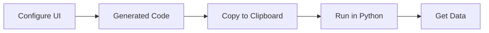

# Code Generator

The **tvscreener Code Generator** is a visual web app that lets you build screener queries without writing code.

[:material-rocket-launch: Launch Code Generator](https://deepentropy.github.io/tvscreener/){ .md-button .md-button--primary }

## Features

- **Visual Filter Builder**: Add filters with dropdowns instead of writing code
- **All 6 Screeners**: Stock, Crypto, Forex, Bond, Futures, and Coin
- **3,500+ Fields**: Browse and select from all available fields
- **Real-time Preview**: See the generated Python code as you configure
- **One-click Copy**: Copy code to clipboard and run locally

## How It Works



1. **Select a Screener**: Choose Stock, Crypto, Forex, Bond, Futures, or Coin
2. **Add Filters**: Use the filter builder to add conditions
3. **Select Fields**: Choose which data columns you want
4. **Configure Options**: Set index filter, sorting, and limit
5. **Copy Code**: Click "Copy Code" and paste into your Python environment
6. **Run**: Execute the code to get your data

## Example Workflow

### 1. Select Screener

Click on "Stock" to screen stocks (the default).

### 2. Add Filters

Click "+ Add Filter" and configure:

- **Field**: Price
- **Operator**: Greater than (>)
- **Value**: 50

Add more filters as needed:

- Volume >= 1,000,000
- RSI(14) < 30

### 3. Select Fields

Use "Select All" for all ~3,500 fields, or pick specific ones:

- Name
- Price
- Change %
- Volume
- RSI(14)

### 4. Configure Options

- **Index**: S&P 500 (optional)
- **Sort by**: Market Cap (descending)
- **Limit**: 100

### 5. Copy and Run

The generated code will look like:

```python
from tvscreener import StockScreener, StockField, IndexSymbol

ss = StockScreener()

# Filters
ss.where(StockField.PRICE > 50)
ss.where(StockField.VOLUME >= 1_000_000)
ss.where(StockField.RELATIVE_STRENGTH_INDEX_14 < 30)

# Fields
ss.select(
    StockField.NAME,
    StockField.PRICE,
    StockField.CHANGE_PERCENT,
    StockField.VOLUME,
    StockField.RELATIVE_STRENGTH_INDEX_14
)

# Index
ss.set_index(IndexSymbol.SP500)

# Sort & Limit
ss.sort_by(StockField.MARKET_CAPITALIZATION, ascending=False)
ss.set_range(0, 100)

df = ss.get()
print(df)
```

## Presets

The Code Generator includes presets for common strategies:

### Stock Presets

- **Basic**: Name, Price, Change, Volume
- **Valuation**: P/E, P/B, P/S, Market Cap
- **Dividends**: Yield, Payout Ratio, Ex-Date
- **Technical**: RSI, MACD, Moving Averages
- **Momentum**: Performance metrics
- **Financial**: Revenue, Margins, Ratios

### Crypto Presets

- **Basic**: Name, Price, Change, Volume
- **Market**: Market Cap, Circulating Supply
- **Technical**: RSI, MACD, Volatility

## Tips

!!! tip "Use Select All for Exploration"
    When exploring available data, use "Select All" to see all ~3,500 fields. You can then narrow down to the fields you need.

!!! tip "Start Simple"
    Begin with one or two filters, verify results, then add more conditions.

!!! tip "Check Field Types"
    Numeric fields support `>`, `<`, `between`. Text fields support `==`, `isin`.

## Limitations

- The Code Generator creates Python code - you still need Python installed to run it
- No backend - all processing happens in your browser
- Generated code requires the `tvscreener` package to be installed

## Feedback

Found a bug or have a feature request?

[Open an Issue on GitHub](https://github.com/deepentropy/tvscreener/issues){ .md-button }
